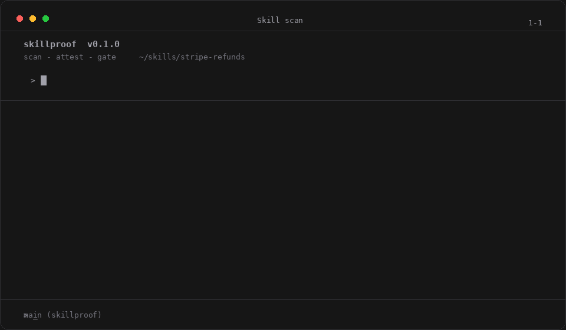

<!-- prettier-ignore -->
<div align="center">


# SkillProof

**Evidence for agent skills — not another place to host them.**

[](LICENSE)
[](package.json)
[](packages/tsconfig.base.json)
[](PLAN.md)
[](https://ravaniroshan.github.io/skillproof/)

:star: If the idea of proof-first skills resonates, star it on GitHub — it helps a lot!

[Overview](#overview) • [Live proofs](#live-proofs) • [Quickstart](#quickstart) • [skills.sh integration](#skills.sh-integration) • [CLI reference](#cli-reference) • [FAQ](#faq)



</div>

Agent skills became a software supply chain: packaged, versioned, installed from third parties, running inside your agent's privileged context. Before you install one, you need three answers:

| Question | SkillProof's answer |
| --- | --- |
| What is it allowed to touch? | Machine-readable capability manifest + version diff |
| Was it tampered with? | Content-hash identity + upstream hash reconciliation |
| Who says so, and can I check? | Ledger record schema, local verification, public proof pages |

> [!WARNING]
> An attestation proves *what was analysed, by which scanner version*. It never certifies safety. Static detection will always be incomplete — the durable promise is the **diff** ("v1.2 added capability X"), not the scan.

## Overview

Skills live on GitHub. SkillProof records, in a public append-only ledger keyed by content hash, what capabilities a skill touches, how that changed between versions, and whether eval results survived a model bump:

- **Scan** a skill directory into a capability manifest — network domains, shell interpreters, filesystem paths, secrets, subagents, MCP servers, hygiene findings. Every value is extracted from content; there are no placeholders.
- **Diff** two manifests. Added or changed capabilities exit `2`, so CI fails a skill update that grows privileges. Removed capabilities are recorded as improvements.
- **Attest** a manifest to the local ledger, then **verify** any reference without permission. Unknown hashes fail closed.
- **skills.sh integration** — search, inspect, and prove any skill from the existing ecosystem, reconcile its upstream hash, and publish a shareable proof page. SkillProof is the evidence layer *around* skills.sh, not a competing marketplace.

```text
skills.sh (discovery) → GitHub (source) → SkillProof (evidence) → developers, registries, agents
```

## Live proofs

[`/skill/`](https://ravaniroshan.github.io/skillproof/skill/) carries content-addressed capability proofs for 25 trending skills, each with its manifest, both hashes, external audit evidence, a verify command, and raw JSON:

- **20 of 25** upstream hashes reproduce exactly from the file snapshot.
- **5 mismatches** (`google/agents-cli/*`) record both hashes and stay under investigation — never normalized away.
- **4 fork groups** found by hash identity (`qu-skills/*` byte-identical to `101-skills/*`) — content addressing beats names, live.

## Quickstart

Prerequisites: Node.js 20+ and npm. The CLI is not published yet, so run it from source:

```bash
git clone https://github.com/RavaniRoshan/skillproof.git
cd skillproof
npm install
npm run build
```

### 1. Scan a skill

```bash
node packages/cli/dist/index.js scan ./my-skill base.json
```

Both arguments are positional. The manifest carries `skillproof/1` schema, frontmatter identity, a real `sha256` content hash, six capability groups plus `hygiene`, and the `scan_version` that produced it.

### 2. Diff two versions

```bash
node packages/cli/dist/index.js diff base.json head.json
```

```text
+ network.outbound_domains: ["evil.example.com"]   (NEW)
  exec.shell: true                                   (unchanged)
```

> [!TIP]
> Run the offline end-to-end loop any time with `bash scripts/demo.sh` — scan, diff, attest, verify, and proof-page generation, no API token needed.

### 3. Attest and verify

```bash
node packages/cli/dist/index.js attest base.json
node packages/cli/dist/index.js verify local@sha256:9f3e…
```

> [!NOTE]
> `attest` currently writes an unsigned local JSONL record; keyless Sigstore signing from CI is tracked in `PLAN.md`. `verify` checks the local ledger and fails closed on unknown hashes. Remote fetch and signature checks are not built yet.

### 4. Eval across model versions (planned, v0.2)

```bash
node packages/cli/dist/index.js eval --agent claude \
  --models sonnet-4.5,sonnet-4.6 --tasks evals/*.md --runs 3 --budget-usd 10
```

The flags are parsed; the harness itself is v0.2 work. See [`PLAN.md`](PLAN.md) §8 for the design.

## skills.sh integration

Read-only commands against the documented [skills.sh API](https://www.skills.sh/docs/api). Authentication uses a Vercel OIDC token from `--token` or `SKILLS_SH_TOKEN`:

```bash
node packages/cli/dist/index.js skills-sh search "react native" --limit 5
node packages/cli/dist/index.js skills-sh inspect vercel-labs/skills/find-skills
node packages/cli/dist/index.js skills-sh proof vercel-labs/skills/find-skills
node packages/cli/dist/index.js skills-sh sync --view trending --limit 10
node packages/cli/dist/index.js verify skills-sh:vercel-labs/skills/find-skills
node packages/cli/dist/index.js proof-url vercel-labs/skills/find-skills
```

`proof` exits `2` on a hash mismatch; `sync` checks a bounded set per run (never the whole ecosystem) and backs the scheduled workflow in `.github/workflows/skills-sh-sync.yml`. Without a token the commands fail with exit `1` and tell you where the token comes from.

Skill authors can run the same scan-and-diff in their own repositories:

```yaml
- uses: RavaniRoshan/skillproof/actions/skillproof@main
  with:
    skill-path: skills/my-skill
    fail-on-new-capability: true
    base-ref: ${{ github.base_ref }}
```

## CLI reference

| Command | Reads | Exit code | Use when |
| --- | --- | --- | --- |
| `scan <skill> <output>` | a skill directory | `0`, or `1` on error | You want a manifest for a skill at a known state |
| `diff <base> <head>` | two manifests | `0` unchanged, `2` added/changed | You are reviewing an update and want new privileges to fail loudly |
| `attest <manifest>` | a manifest | `0`, or `1` on error | You want the record findable by content hash |
| `verify <reference>` | a reference | `0` on success, `1` otherwise | You are about to install something attested by someone else |
| `skills-sh …` | the skills.sh API | `0`, `2` on mismatch, `1` on error | You want upstream metadata or a snapshot proof |
| `proof-url <ref>` | nothing (offline) | `0`, or `1` on error | You want the shareable proof page URL |
| `eval` | tasks, models, budget | prints and exits | Not yet — the harness is v0.2 |

Full flags and statuses: [`site/guide/cli.md`](site/guide/cli.md). Scanner limits: [`docs/limitations.md`](docs/limitations.md).

## Repository layout

```text
skillproof/
├── packages/
│   ├── cli/            # skillproof CLI: scan, diff, attest, verify, skills-sh
│   ├── schemas/        # Zod source of truth + generated contracts
│   └── skills-sh/      # upstream adapter: client, normalize, reconcile, discover
├── site/               # VitePress marketing + docs + /skill/ proof pages
│   ├── proof-data/     # checked-in proof records (generate.mjs / ingest.mjs)
│   └── public/proof/   # raw machine-readable manifests
├── actions/skillproof/ # GitHub Action for skill authors
├── outreach/           # author outreach drafts (unsent)
├── docs/limitations.md # what the scanner can and cannot see
├── openapi/v1.yaml     # read API (generated — do not hand-edit)
└── PLAN.md             # scope, roadmap, kill criteria, progress log
```

Schemas are the single source of truth — never hand-edit `openapi/v1.yaml` or `*.schema.json`; change `packages/schemas/src/index.ts` and regenerate:

```bash
npm run generate -w skillproof-schemas
```

## Development

```bash
npm run build       # compile all workspaces
npm run typecheck   # strict tsc
npm run lint        # eslint + prettier (0 errors)
npx vitest run      # test suite (must stay green)
npm run docs:build  # static site to dist/
```

`PLAN.md` is the source of truth for scope, roadmap, kill criteria, and per-session progress. The site builds from `site/` on every docs change; proof pages regenerate from snapshots via `site/proof-data/`.

## FAQ

**Do you host or distribute skills?**
No. Skills stay in git. The repo stores manifests, hashes, and proof pages — never third-party skill code.

**How is this different from skills.sh?**
skills.sh tells you what skills exist. SkillProof tells you what has been proven about a skill — and both hashes when the two disagree.

**Does an attestation prove a skill is safe?**
No, and we never claim it does. Evidence, never guarantees.

**Why key records by content hash instead of skill name?**
Names are squattable; hashes are not. Forks and copies share one identity automatically — the live proofs caught four such groups on day one.

**What happens when the scanner misses something?**
Detection will never be complete; that is a stated limitation, not a hidden bug. The durable promise is the diff between two versions.

## Resources

- [Documentation](https://ravaniroshan.github.io/skillproof/) — guide, CLI reference, read API, changelog
- [Skill proofs](https://ravaniroshan.github.io/skillproof/skill/) — 25 live capability proofs
- [PLAN.md](PLAN.md) — scope, locked decisions, kill criteria, progress log
- [skills.sh API](https://www.skills.sh/docs/api) — the upstream integration surface
- [Sigstore](https://www.sigstore.dev/) — the keyless signing the attestation record is designed for
